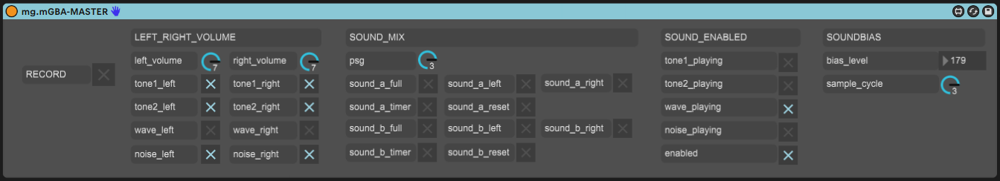
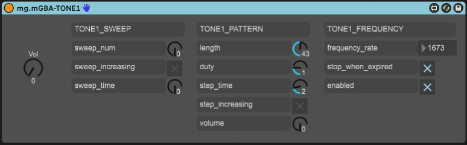
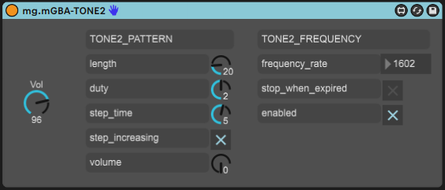
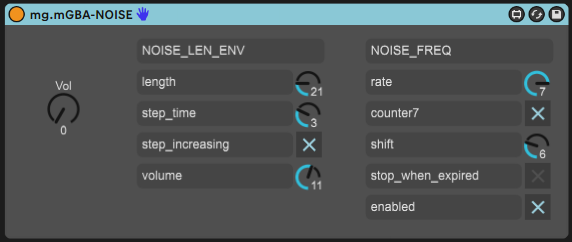
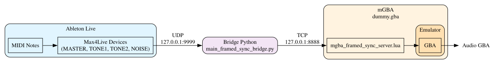

# GBA Playground

## Overview

Ce dépôt contient plusieurs projets d'exploration pour le développement Game Boy
Advance en Rust. La compilation cible l'architecture `thumbv4t-none-eabi` et
`mgba` est utilisé comme émulateur par défaut (voir `.cargo/config.toml`). Les
exécutables principaux se trouvent dans `src/bin/` et incluent différents tests
ou prototypes (`egj2024`, `egj2025`, `platformer`, etc.). Le code commun est
exposé via la bibliothèque située dans `src/`.  

En cas de problèmes, consultez le fichier [TROUBLESHOOT.md](TROUBLESHOOT.md)

## Préparation

Certaines ressources sont générées à l'aide de scripts Python disponibles dans
le dossier `scripts`. Ces scripts python peuvent être directement executés avec [uv](https://docs.astral.sh/uv/getting-started/installation/).

Depuis `scripts/` :

Générez ensuite les données musicales utilisées par la bibliothèque :

```bash
uv run main_generate_tune_rs.py
```

Des utilitaires supplémentaires, comme `main_convert_sprites.py`, permettent de
convertir les graphismes en palettes et tuiles compatibles GBA.

## Compilation

Le projet nécessite Rust nightly. Avant la première compilation, installez les
composants pour la cible GBA :

```bash
rustup component add rust-src
rustup target add thumbv4t-none-eabi
```

Vous pouvez ensuite construire la version finale :

```bash
cargo build --release
```

## Exécution

Installez l'émulateur [mGBA](https://mgba.io/downloads.html). Grâce à la
configuration dans `.cargo/config.toml`, la commande suivante lance
l'exécutable par défaut (`egj2025`) directement dans l'émulateur :

```bash
cargo run
```

Pour exécuter un autre binaire, par exemple celui de `src/bin/egj2024.rs`, utilisez :
```bash
cargo run --bin egj2024
```

Pour exécuter en release :
```bash
cargo run --bin egj2024 --release
```

Pour générer un fichier `.gba` exécutable, utilisez :

```bash
cargo build --release
cp target/thumbv4t-none-eabi/release/egj2025 egj2025.gba
mgba egj2025.gba
```

## Tests

Des tests unitaires existent pour la partie bibliothèque. Ils s'exécutent sur l'une des cibles suivantes:
- Linux: `x86_64-unknown-linux-gnu`
- Windows: `x86_64-pc-windows-msvc`

Sur linux:
```bash
cargo test --lib --target=x86_64-unknown-linux-gnu
```

## Logging

Le module `log4gba` offre des macros simples pour afficher des messages dans la
console de l'émulateur :

```rust
log4gba::debug("Hello world!")
```

Les logs apparaissent dans la fenêtre *Logs* de mGBA (`Tools > View Logs…`).

# Le jeu egj2025
Le jeu `egj2025` est un jeu d'aventure où le joueur doit résoudre
des énigmes en jouant avec des malentendus. le scénario est décrit dans
`story-board.md`. 


# Composer de la musique

## Outils

La musique est composée avec Ableton Live et quatre plugins Max4Live qui transforment les notes MIDI en valeurs de registres GBA :


#### mg.mGBA-MASTER.amxd

#### mg.mGBA-TONE1.amxd

#### mg.mGBA-TONE2.amxd

#### mg.mGBA-NOISE.amxd


## Architecture de communication



1. **Ableton Live** envoie les notes MIDI via UDP (`127.0.0.1:9999`)
2. **Bridge** (`scripts/remote/pyGBA/main_framed_sync_bridge.py`) reçoit et transfère en TCP (`127.0.0.1:8888`)
3. **mGBA** exécute la rom `dummy.gba` avec le script `scripts/remote/mgba_framed_sync_server.lua` pour écrire dans les registres audio

## Lancement

1. **Démarrer le serveur mGBA :** 
   1. Lancer l'emulateur avec la rom dummy.gba:   
        ```bash
        cargo run --bin dummy --release
        ```
   1. Ouvrir la fenêtre des scripts: `Tools > Scripting...` et charger le script `scripts/remote/mgba_framed_sync_server.lua`
2. **Démarrer le bridge:**
    ```bash
    cd scripts/remote/pyGBA
    uv run ./main_framed_sync_bridge.py
    ```
    (En cas de `ConnectionRefusedError`, vérifier que le serveur mGBA est bien démarré et que le script Lua est chargé)
3. **Démarrer Ableton Live** et jouer les clips MIDI pour entendre la musique dans mGBA

